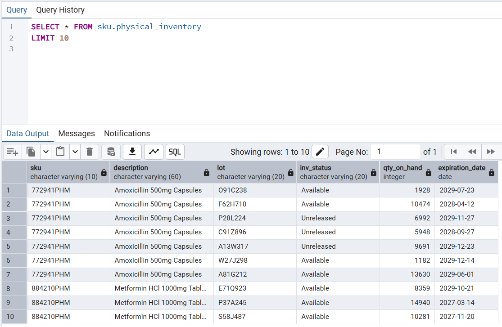
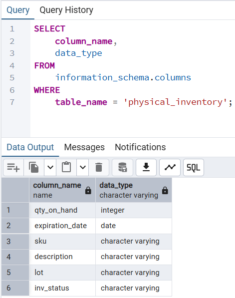
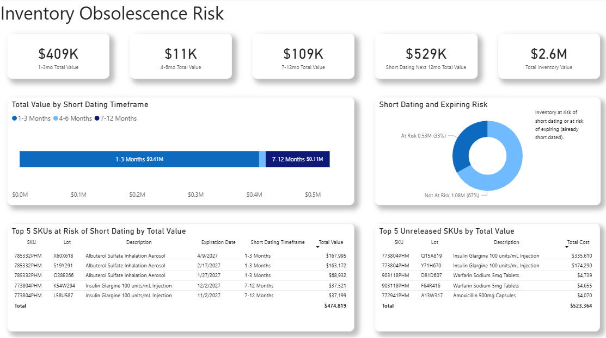
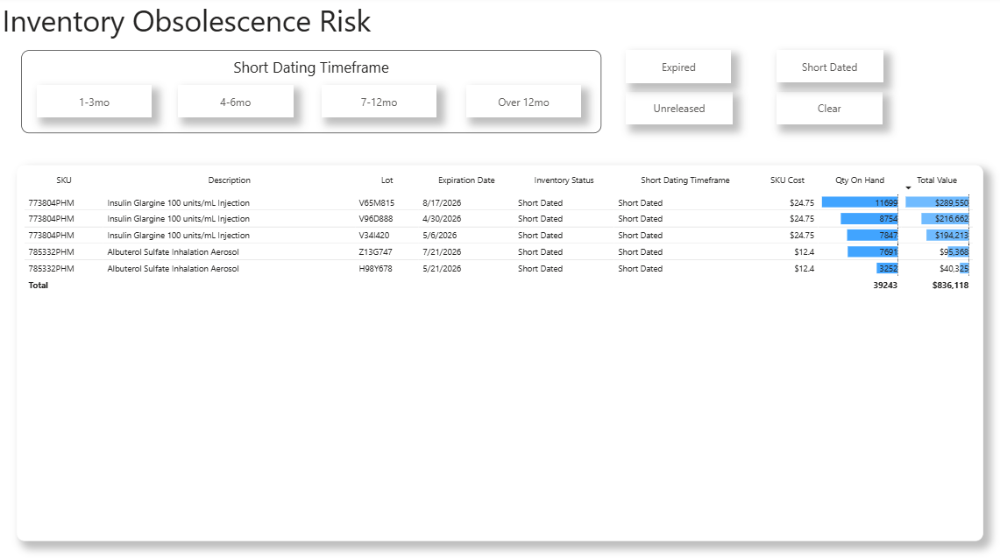

# 🔍 Inventory Obsolescence Risk Dashboard
## 📌 Project Overview

In this project I created a tool for determining inventory at risk of becoming short-dated and eventually expiring. The insights and data presented in this dashboard will help Supply Chain, QA and Commercial Teams collaborate on eliminating inventory waste and reduce costly destructions. The project uses a **synthetic inventory snapshot and inventory costs**; no real data was used in this project.

The inventory snapshot data was generated using AI an Python. I then loaded the data into a PostgreSQL database to serve as the source of truth. I used Power Query to extract the data using SQL, and add conditional values based on expiration dates and an assummed 365 day aging profile across all SKUs.

This project closely reflects my day-to-day work in inventory analytics in a pharmaceutical environment.

**Note:** This project is an oversimplification of a real inventory data.

---

## 🧠 Problem Statement

Raw inventory data is often stored in complex ERP systems or static spreadsheets. While the data exists, it isn't actionable. Stakeholders need a way to transform thousands of rows of lot-level data into a prioritized "hit list" that identifies exactly which products need immediate attention to save their value. This will reduce or eliminate costly write-offs and product destructions.

---

## 🏗️ Workflow and Tools Overview

ChatGPT & Python (Synthetic Data Generation)

  ⬇️
  
PostgreSQL (Relational Database Storage)

  ⬇️
  
PowerBI (Ingestion, Rule Validation, Visualization)

---

### 🛠️ Data Generation (Python)

-  Leveraged AI to create a [Python script](python/synth_inv_snapshot.py) used to generate a synthetic inventory snapshot for 15 SKUs and 123 unique lots. The script allowed me to customize the minimum and maximum number of lots for each SKU. The otput was not perfect, and minor adjustments were made to the output to resemble real-world date. eg. inventory status for lots with past expiration dates were updated to "Expired".
-  Included fields such as:
    -  SKU Number/Material Number
    -  Description with dosage form and strength
    -  Lot
    -  Inventory Status (Available, Unreleased, Short Dated, or Expired)
    -  Quantity on Hand
    -  Expiration Date
- Anther script was used to generate random costs for each of the 15 SKUs.
 ---


### 🗄️ Data Storage (PostgreSQL)

I loaded the synthetic datasets (csv format) into a local PostgreSQL database using the pgAdmin 4 admin tool. The table columns resemble those of the csv dataset headers.

**Inventory First 10 rows**

 

**Column Names and Data Types**



### 🔍 Data Ingestion and Short Date Profiling (Power BI)

-  I used PowerQuery to conenct to the local PostgreSQL database, and then loaded the data using using Import Mode so I could add Custom Columns. In this step I added a SQL query that would add an additional column to categorize expiration dates.
    - Aging profile on all lots is 365 days i.e. lots will go into short-dated status 365 days before the expiration date
    - Lots are categorized by when they will short-date relative to the present date: 1-3 months, 4-6 months, 7-12 months, or over 12 months into the future.
-  Added a custom column to determine of lot was at risk nor not at-risk of short dating or expiring (i.e. already short dated)

**Initial Load into PowerQuery** [M code](powerquery/M-code.txt)

### 📊 Dashboard Features, Insights, and Inventory Detail

The design of the Power BI dashboard includes:
-  Total value of inventory by short-dating timeframe (cards)
-  Total inventory value (card)
-  Visual breakdown of inventory short-dating within the next 12 months (graph)
-  Visual breakdown of at-risk and not-at-risk inventory (graph)
-  List of top 5 SKU/Lots at risk of short-dating by value (table)
-  List of top 5 SKU/Lots in "Unreleased" status (table)
-  Inventory detail view for all inventory under analysis with buttons for quick filtering (new page with table)

**Dashoard**



**Inventory Detail (Short Dated filter applied)**



**The dashboard is reporting $409k of all inventory ($2.6m) is at risk of short-dating within the next three months.** Overall, $529k in inventory will short-date within the next 12 months. The highest risk lies on SKU 785332PHM, Lot X60X618 (Albuterol Sulfate Inhalation Aerosol) at $168k short-dating in less than three months.

In the details page we see that there is about **$836k in inventory is already short-dated.**

Several **actionables** can be determined by using this dashboard

  -  Commercial teams should reach out to existing customers about taking short-dated inventory at a discounted price.
  -  Supply Chain and QA should work on releasing Unreleased inventory before it becomes short-dated.
  -  Planing and Supply Chain Teams should work on better forecasts for Albuterol Sulfate Inhalation Aerosol (785332PHM), adjusting production or purchase orders if sourced from a CMO.

---

## 🗂️ Repository Structure

```text
/
├── powerquery/           # Power Query (M) scripts for PostgreSQL ingestion and ETL
├── powerbi/              # Power BI dashboard file
├── docs/                 # Screenshots 
├── python/               # Python script 
└── README.md
